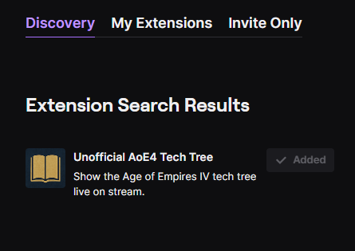
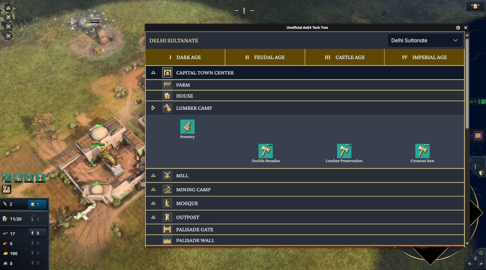

# Unofficial AoE4 Tech Tree

This repository hosts a **Tech Tree Viewer** for *Age of Empires 4*.  
Developed as twitch extension in mind to help viewers explore the different's civilizations  buildings, units and technologies visually.

Available for your stream too!  
https://dashboard.twitch.tv/extensions/sqehvbw87hp47wqzoz88se83d0xlcw-1.0.0  


---

## Tech Stack

- **React**
- **TypeScript**
- **Vite** (build tool)
- **PrimeReact** & **PrimeFaces** (UI components)

---

## Features

- Interactive tech tree visualization
- Dynamic data fetching from AoE4World API
- Twitch Extension helper script included for integration as Twitch extension



---

## Setup & Development

1. Install dependencies:
   ```bash
   npm install
   ```

2. Run the development server:
   ```bash
   npm run dev
   ```

3. Build for production:
   ```bash
   npm run build
   ```

---

## Data Sources

The application fetches data and images from the AoE4World Data API (https://github.com/aoe4world/data):

- `https://data.aoe4world.com/buildings/all.json`
- `https://data.aoe4world.com/technologies/all.json`
- `https://data.aoe4world.com/units/all.json`
- `https://data.aoe4world.com/images/buildings/{building-id}.png`
- `https://data.aoe4world.com/images/technologies/{technology-id}.png`
- `https://data.aoe4world.com/images/units/{unit-id}.png`

---

## Notes

- This project does **not** own or control the AoE4World API or Age of Empires 4 game content.
- All data is fetched live and validated before display.
- All data is open source and may be used in your projects, websites, and apps. However, **Microsoft owns the copyright to Age of Empires 4**. You **cannot use this data in commercial contexts** except as allowed under Microsoft's [Game Content Usage Rules](https://www.xbox.com/en-US/developers/rules).
- Whenever using data from this repository or any Age of Empires 4 media, please ensure you comply with Microsoft's rules.

---

## Credits

Created by **Kropik123**.

---

## License

This project is licensed under the [MIT License](LICENSE).

All data is open source and may be used in your projects, websites, and apps. However, Microsoft owns the copyright to Age of Empires 4. You cannot use this data in commercial contexts except as allowed under Microsoft's Game Content Usage Rules.

> Age Of Empires 4 © Microsoft Corporation.  
> Unofficial AoE4 Tech Tree was created under Microsoft's "Game Content Usage Rules" using assets from Age of Empires 4, and it is not endorsed by or affiliated with Microsoft.


---

Feel free to contribute or report issues!
